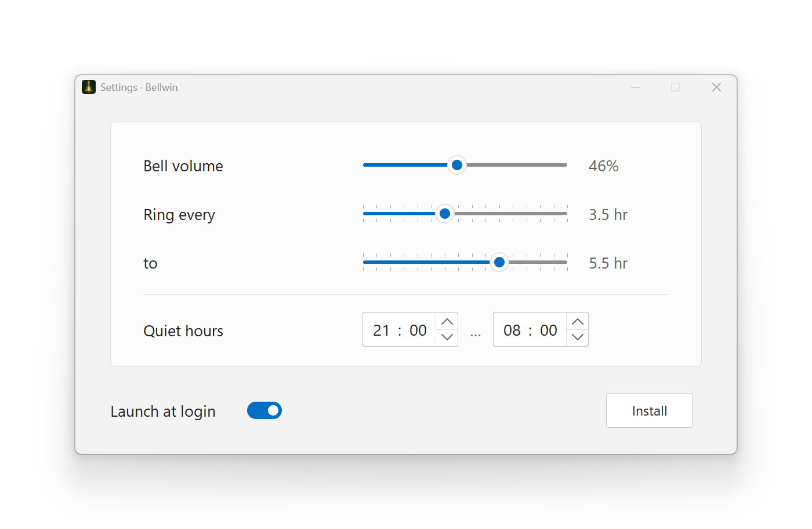

# Bellwin

Bellwin rings a bell at an unpredictable time as a mindfulness reminder.

<picture>
  <source media="(prefers-color-scheme: dark)" srcset="resources/screenshot-dark.png">
  <source media="(prefers-color-scheme: light)" srcset="resources/screenshot-light.png">
  
</picture>

## Origins

Bellwin was inspired by [Ilya Birman's Tart Bell](https://ilyabirman.ru/meanwhile/all/tart-bell-mac/), a small macOS menu bar app that rings at unpredictable intervals as an exercise in mindfulness and a reminder to return one's attention to the present moment.

The idea behind Tart Bell comes from Charles T. Tart's _Living the Mindful Life_. Tart describes using a bell as an "alarm clock": when it rings, stop for a few seconds and become present again. Birman's notes on the book cover this in [part 1](https://ilyabirman.ru/meanwhile/all/tart-living-the-mindful-life-book-1/) and [part 2](https://ilyabirman.ru/meanwhile/all/tart-living-the-mindful-life-book-2/).

Birman later published the [prompts and notes from building Tart Bell with Codex](https://ilyabirman.ru/meanwhile/all/tart-bell-vibe-coded/). Tart Bell’s basic shape carried over to Bellwin: a tray application, unpredictable intervals, a manual Ring command, and a record of the previous ring. Bellwin takes the same idea to Windows and builds on it with Windows-specific features.

## Usage / Installation

Download and run the latest [Bellwin.exe](https://github.com/k00lagin/bellwin/releases). The executable is not signed, so you might see a SmartScreen warning - click **More info** → **Run anyway**. The installation is not required, you can run the app from any directory. The **Install** button copies the executable to `%LOCALAPPDATA%\Bellwin\Bellwin.exe`, creates a shortcut in the Start menu, and registers Bellwin in Windows Installed Apps for the current user.

## Build

The build system requires Clang, LLD and `llvm-rc` and uses Tsoding's [nob](https://github.com/tsoding/nob.h). The build recipe itself is a C program in `src/nob.c`; a prebuilt `nob.exe` is committed at the repository root, so building takes one command:

```powershell
.\nob.exe
```

`nob.exe` rebuilds itself when either `src/nob.c` or the vendored `src/thirdparty/nob.h` changes. To bootstrap `nob.exe` from scratch, compile `src/nob.c` with any C compiler.

The build system produces `Bellwin.exe`, a 32-bit Windows GUI executable targeting Windows 7 (`6.1`) and newer. The application icon and bell sound are compiled into the executable.

Run the tests with:

```powershell
.\nob.exe --test
```

Tests are in `src/tests/`, vendored single-header libraries in `src/thirdparty/`, application resources are in `resources/`, and intermediate build files go to `.build/`.
